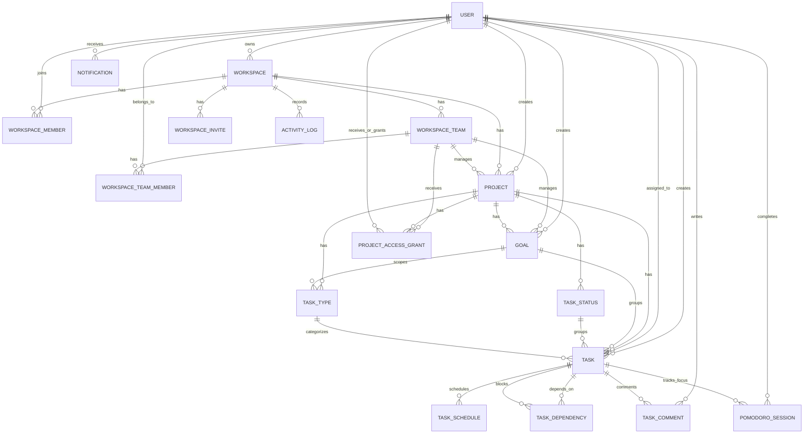

# 03. Mô Hình Dữ Liệu, Entity Và Quan Hệ

## 1. Nhóm entity chính

Chronelis hiện xoay quanh 4 nhóm entity lớn:

1. Nhóm người dùng và phân quyền hệ thống: `User`, `Role`, `Permission`.
2. Nhóm cộng tác workspace: `Workspace`, `WorkspaceMember`, `WorkspaceTeam`, `WorkspaceTeamMember`, `WorkspaceInvite`.
3. Nhóm phân quyền project: `ProjectAccessGrant`.
4. Nhóm thực thi công việc: `Project`, `Goal`, `TaskStatus`, `TaskType`, `Task`, `TaskDependency`, `TaskSchedule`, `TaskComment`, `PomodoroSession`.
5. Nhóm theo dõi sự kiện: `Notification`, `ActivityLog`.

## 2. Sơ đồ quan hệ mức khái niệm

## 3. Bảng mô tả entity

| Entity                | Vai trò                | Trường quan trọng                                                                                       | Ghi chú                                 |
| --------------------- | ---------------------- | ------------------------------------------------------------------------------------------------------- | --------------------------------------- |
| `User`                | người dùng hệ thống    | `userId`, `email`, `phoneNumber`, `isVerified`, `roles`, `refreshToken`                                 | định danh bằng UUID                     |
| `Role`                | vai trò hệ thống       | `roleId`, `name`, `description`, `active`                                                               | dùng cho admin/RBAC toàn hệ thống       |
| `Permission`          | quyền API              | `permissionId`, `apiPath`, `httpMethod`, `module`                                                       | authorize động bằng interceptor         |
| `Workspace`           | không gian làm việc    | `id`, `name`, `owner`                                                                                   | mỗi workspace có một owner              |
| `WorkspaceMember`     | thành viên workspace   | `workspace`, `user`, `role`, `joinedAt`                                                                 | role là `OWNER/MEMBER`                  |
| `WorkspaceTeam`       | nhóm nội bộ workspace  | `workspace`, `name`, `description`, `createdBy`                                                         | dùng cho phân công manager theo team    |
| `WorkspaceTeamMember` | thành viên của team    | `team`, `user`, `joinedAt`                                                                              | user phải là member của workspace trước |
| `WorkspaceInvite`     | mã mời vào workspace   | `inviteCode`, `roleToAssign`, `maxUses`, `usedCount`, `expiresAt`, `isActive`                           | mặc định assign `MEMBER` nếu bỏ trống   |
| `Project`             | dự án trong workspace  | `workspace`, `name`, `description`, `status`, `visibility`, `managerUser`, `managerTeam`                | `PUBLIC/PRIVATE`, có manager theo user/team |
| `ProjectAccessGrant`  | quyền theo project     | `project`, `subjectType`, `user`, `team`, `role`, `grantedBy`                                           | grant trực tiếp cho user hoặc team      |
| `Goal`                | mục tiêu trong project | `project`, `title`, `goalType`, `status`, `progressPercent`, `managerUser`, `managerTeam`               | tiến độ tính từ task linked             |
| `TaskStatus`          | cột Kanban             | `project`, `name`, `code`, `position`, `isClosed`                                                       | `isClosed=true` đại diện cột hoàn tất   |
| `TaskType`            | kiểu công việc         | `workspaceId`, `projectId`, `goalId`, `name`, `color`, `icon`                                           | phục vụ phân loại task                  |
| `Task`                | đơn vị công việc       | `project`, `goal`, `status`, `lastOpenStatus`, `priority`, `sourceView`, `boardPosition`, `isCompleted` | entity trung tâm của hệ thống           |
| `TaskDependency`      | phụ thuộc giữa task    | `task`, `dependsOnTask`, `blockerNote`, `createdAt`                                                     | chống tạo vòng dependency               |
| `TaskSchedule`        | lịch của task          | `task`, `scheduledStart`, `scheduledEnd`, `scheduledDate`                                               | phục vụ calendar và planning            |
| `TaskComment`         | bình luận task         | `task`, `parentCommentId`, `user`, `content`                                                            | hỗ trợ comment dạng lồng                |
| `PomodoroSession`     | phiên Pomodoro         | `task`, `user`, `durationMinutes`, `createdAt`                                                          | lưu focus session đã hoàn tất           |
| `Notification`        | thông báo người dùng   | `user`, `type`, `title`, `message`, `referenceType`, `referenceId`, `isRead`                            | có realtime publish                     |
| `ActivityLog`         | lịch sử hoạt động      | `workspace`, `actor`, `actionType`, `targetType`, `targetId`, `description`                             | lọc theo actor/action/target/date       |

## 4. Phân tích entity `Task`

`Task` là thực thể quan trọng nhất trong Chronelis vì nó nối các khái niệm project, goal, assignee, status, lịch, ghi chú và notification.

### 4.1. Các field thể hiện nghiệp vụ chính

- `goal`: liên kết task vào một mục tiêu.
- `status`: cột Kanban hiện tại.
- `lastOpenStatus`: cột mở gần nhất trước khi task bị đưa vào trạng thái hoàn thành.
- `notesHtml`: ghi chú rich text.
- `priority`: mức ưu tiên `LOW/MEDIUM/HIGH/URGENT`.
- `importanceLevel`, `urgencyLevel`: hai chiều mở rộng để đánh giá mức độ công việc.
- `sourceView`: nguồn tạo task ban đầu `KANBAN/TODO/CALENDAR`.
- `boardPosition`: thứ tự trong cột.
- `isCompleted`, `completedAt`: trạng thái hoàn thành logic.

### 4.2. Ý nghĩa của `lastOpenStatus`

Field này giúp khôi phục task về cột đang mở khi người dùng chuyển task từ completed về incomplete. Đây là điểm cho thấy backend đã giải quyết vấn đề đồng bộ giữa completed state và Kanban status tốt hơn mô hình checklist đơn giản.

## 5. Quan hệ manager theo user hoặc team

### 5.1. Project manager

`Project` có thể được gán:

- `managerUser`
- hoặc `managerTeam`

Nếu manager team được chọn, thành viên của team đó được xem là có quyền quản lý project.

### 5.2. Goal manager

`Goal` cũng có mô hình tương tự project. Điều này cho phép phân rã quyền quản lý theo cấp mục tiêu mà không cần owner workspace hoặc project manager thao tác mọi task.

## 6. Enum nghiệp vụ quan trọng

### 6.1. Role theo workspace

- `OWNER`
- `MEMBER`

### 6.2. Visibility project

- `PUBLIC`
- `PRIVATE`

### 6.3. Role project access

- `VIEWER`
- `CONTRIBUTOR`
- `MANAGER`

### 6.4. Effective project access

- `NO_ACCESS`
- `VIEWER`
- `CONTRIBUTOR`
- `MANAGER`

### 6.5. Trạng thái project

- `ACTIVE`
- `COMPLETED`
- `ARCHIVED`

### 6.6. Loại goal

- `SHORT_TERM`
- `MEDIUM_TERM`
- `LONG_TERM`

### 6.7. Trạng thái goal

- `NOT_STARTED`
- `IN_PROGRESS`
- `COMPLETED`
- `ON_HOLD`

### 6.8. Mức ưu tiên task

- `LOW`
- `MEDIUM`
- `HIGH`
- `URGENT`

### 6.9. Nguồn view của task

- `KANBAN`
- `TODO`
- `CALENDAR`

## 7. Ràng buộc dữ liệu quan trọng

1. User chỉ được thêm vào workspace một lần.
2. Thành viên team phải là thành viên workspace trước.
3. Invite mặc định gán `MEMBER` nếu request không truyền `roleToAssign`.
4. Không được hạ cấp `OWNER` cuối cùng của workspace.
5. Manager team của project/goal phải thuộc cùng workspace.
6. Assignee của task phải thuộc cùng workspace.
7. Goal của task phải thuộc cùng project.
8. Task type của task phải thuộc cùng project.
9. `progressPercent` của goal nằm trong khoảng `0..100`.
10. `estimatedMinutes` không được âm.
11. Dependency của task không được tạo vòng.
12. Project access grant phải trỏ đúng một subject: user hoặc team.

## 8. Mô hình trả về từ API

Các response DTO hiện dùng nhiều nhất:

- `WorkspaceResponse`
- `WorkspaceMemberResponse`
- `WorkspaceTeamResponse`
- `ProjectResponse`
- `GoalResponse`
- `TaskResponse`
- `TaskStatusResponse`
- `TaskTypeResponse`
- `TaskScheduleResponse`
- `TaskCommentResponse`
- `NotificationResponse`
- `ActivityLogResponse`

Điều này giúp frontend nhận payload gọn hơn entity gốc, đồng thời tránh lộ lazy relation hoặc internal field không cần thiết.

## 9. Kết luận dữ liệu

Mô hình dữ liệu của Chronelis cho thấy đây là hệ thống quản lý công việc có cấu trúc chặt chẽ. Dữ liệu được tổ chức theo hướng cộng tác nhiều tầng: người dùng -> workspace -> project -> goal -> task. Bên cạnh đó, các thực thể `Notification`, `ActivityLog`, `WorkspaceInvite`, `TaskSchedule` và `lastOpenStatus` trong `Task` thể hiện rõ định hướng của hệ thống là realtime, có truy vết và hỗ trợ nhiều ngữ cảnh làm việc khác nhau.
