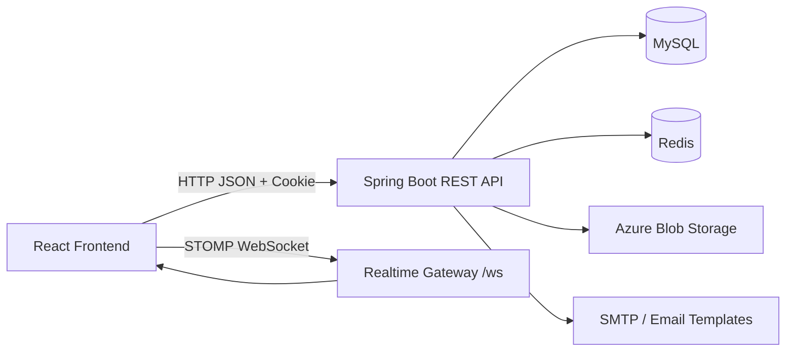

# 04. Kiến Trúc Hệ Thống Và Tích Hợp Frontend/Backend

## 1. Kiến trúc tổng thể

Chronelis hiện được tổ chức theo kiến trúc client-server với hai phần chính:

- Frontend SPA viết bằng React + TypeScript.
- Backend RESTful + WebSocket viết bằng Spring Boot.



## 2. Kiến trúc backend

### 2.1. Tầng xử lý

Backend đi theo luồng:

1. Controller nhận request.
2. Spring Security kiểm tra JWT nếu endpoint protected.
3. `PermissionInterceptor` kiểm tra quyền động theo `apiPath + httpMethod`.
4. Service triển khai logic nghiệp vụ.
5. Repository tương tác database.
6. Mapper chuyển entity sang response DTO.
7. `ApiResponse<T>` chuẩn hóa dữ liệu trả về.

### 2.2. Các package quan trọng

- `controller/rest`: endpoint REST.
- `service/implement`: xử lý use case.
- `repository`: truy cập dữ liệu.
- `domain`: entity JPA.
- `dto/request`, `dto/response`: hợp đồng API.
- `mapper`: MapStruct mapper.
- `configuration`: security, websocket, seed, mail, Azure Blob.
- `exception`: error code và global handler.

## 3. Kiến trúc frontend

### 3.1. Thành phần chính

- `AppRouter`: định tuyến public, protected, admin.
- `AppShell`: layout chính của user đã đăng nhập.
- `TanStack Query`: lấy dữ liệu và quản lý cache.
- `Zustand`: lưu auth state, UI state.
- `Feature modules`: auth, workspaces, tasks, goals, notifications, profile, admin.
- `WebSocket hooks`: subscribe domain events để cập nhật realtime.

### 3.2. Các route nghiệp vụ tiêu biểu

- `/dashboard`
- `/workspaces`
- `/workspaces/:workspaceId`
- `/workspaces/:workspaceId/projects/:projectId`
- `/workspaces/:workspaceId/projects/:projectId/goals/:goalId/tasks`
- `/workspaces/:workspaceId/projects/:projectId/pomodoro/:taskId`
- `/workspaces/:workspaceId/projects/:projectId/tasks/:taskId/notes`
- `/notifications`
- `/profile`
- `/join`
- `/admin/:section`

## 4. Kiến trúc module theo nghiệp vụ

### 4.1. Auth và account

- Backend: `AuthenticationController`, `UserController`.
- Frontend: `login-page`, `register-page`, `forgot-password-page`, `reset-password-page`, `verify-account-page`, `verify-email-change-page`.

### 4.2. Collaboration

- Backend: `WorkspaceController`, `WorkspaceInviteController`, `WorkspaceTeamController`.
- Frontend: `workspaces-page`, `workspace-detail-page`, `join-by-invite-page`.

### 4.3. Delivery execution

- Backend: `ProjectController`, `GoalController`, `TaskController`, `TaskStatusController`, `TaskTypeController`, `TaskScheduleController`, `TaskCommentController`.
- Frontend: `tasks-layout`, `kanban-page`, `calendar-page`, `todo-page`, `goals-page`, `goal-tasks-page`, `task-pomodoro-page`, `task-notes-page`.

### 4.4. Realtime và audit

- Backend: `NotificationController`, `ActivityLogController`, `RealtimeEventPublisherServiceImpl`.
- Frontend: `notifications-page`, `activity-log-page`, `useTaskRealtime`, `useWorkspaceRealtime`.

### 4.5. Admin

- Backend: `UserController`, `RoleController`, `PermissionController`.
- Frontend: `admin-dashboard-page` và `admin-shell`.

## 5. Auth, token và permission model

## 5.1. Mô hình xác thực

- Access token dùng JWT.
- Refresh token được trả bằng cookie `refresh_token` kiểu HttpOnly.
- Frontend cấu hình `withCredentials=true` để refresh flow hoạt động.

## 5.2. Mô hình phân quyền hai lớp

Chronelis có hai lớp quyền khác nhau:

### Lớp 1: quyền hệ thống

- `ADMIN`
- `USER`

Lớp này quyết định khả năng truy cập module admin và được kiểm tra qua `PermissionInterceptor`.

### Lớp 2: role trong workspace

- `OWNER`
- `ADMIN`
- `MEMBER`

Lớp này quyết định quyền thao tác trong workspace/project/goal/task.

## 6. Tích hợp realtime

### 6.1. Endpoint websocket

- Handshake endpoint: `/ws`

### 6.2. Prefix và channel

- broker public/private
- inbound prefix: `/server`
- user/private channels cho notification

### 6.3. Channel sử dụng trong hệ thống

- `/public/workspaces/{workspaceId}/events`
- `/public/workspaces/{workspaceId}/projects/{projectId}/events`
- `/public/workspaces/{workspaceId}/projects/{projectId}/tasks/{taskId}/events`
- `/user/{userId}/private/notifications`
- `/user/{userId}/private/notifications/unread-count`

## 7. Tích hợp email và storage

### 7.1. Email

Backend dùng Thymeleaf template để gửi:

- verify account
- forgot/reset password
- verify change email

Các link email đang align với frontend route:

- `/auth/verify-active-account?token=...`
- `/auth/reset-password?token=...`
- `/auth/verify-change-email?token=...`

### 7.2. File storage

Frontend màn notes upload ảnh lên backend qua Azure Blob API. Backend xử lý upload/delete/move file ở Azure Blob Storage và trả URL để nhúng trực tiếp vào HTML notes.

## 8. Tích hợp frontend với backend theo kiểu dữ liệu

### 8.1. Chuẩn response

Backend luôn trả:

```json
{
    "success": true,
    "message": "...",
    "data": {},
    "meta": {
        "timestamp": "...",
        "instance": "/api/v1/..."
    }
}
```

### 8.2. Pagination

Pagination dùng `PaginationResponse` và backend bật one-indexed pageable, tức là trang đầu tiên là `page=1`.

### 8.3. Filter DSL

Một số API admin dùng `SpringFilter DSL` thay vì query param rời rạc, ví dụ:

`?filter=name:'ADMIN' and active:true`

## 9. Các quyết định kiến trúc đáng chú ý

1. Tách permission hệ thống và role trong workspace để linh hoạt hơn.
2. Tách `TaskStatus`, `TaskType`, `Goal`, `TaskSchedule`, `TaskComment` thành module riêng thay vì nhét chung vào task.
3. Dùng realtime event publisher ở backend thay vì để frontend polling liên tục.
4. Dùng DTO response riêng để tránh lộ entity nội bộ.
5. Dùng `lastOpenStatus` để giữ nhất quán giữa Kanban và completion state.

## 10. Ý nghĩa học thuật và kỹ thuật của kiến trúc này

Từ góc nhìn đề tài thực tập tốt nghiệp, kiến trúc hiện tại có giá trị vì:

- thể hiện rõ phân tầng frontend/backend
- có cả REST, realtime, email và storage integration
- có cơ chế phân quyền nhiều cấp
- có dữ liệu đủ phong phú để phân tích entity, workflow, use case và ER/UML
- phù hợp để trình bày như một sản phẩm phần mềm hoàn chỉnh chứ không chỉ là demo CRUD đơn giản

## 11. Kết luận kiến trúc

Chronelis đang được xây theo hướng một hệ thống cộng tác công việc hiện đại: frontend React chịu trách nhiệm trải nghiệm người dùng và đồng bộ state, backend Spring Boot xử lý nghiệp vụ và bảo mật, WebSocket đảm nhận realtime, còn email/Azure Blob Storage mở rộng giá trị vận hành. Đây là nền tảng tốt để viết phần phương pháp nghiên cứu, kiến trúc và triển khai trong đề cương cũng như báo cáo thực tập tốt nghiệp.
